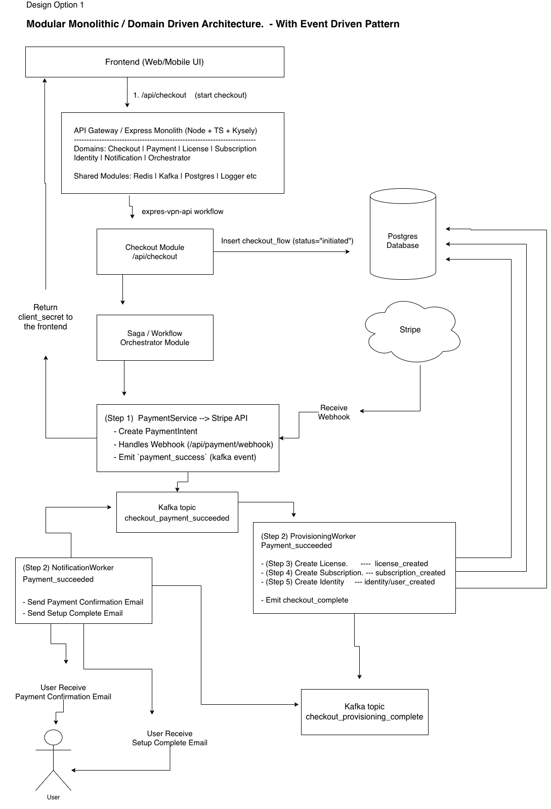
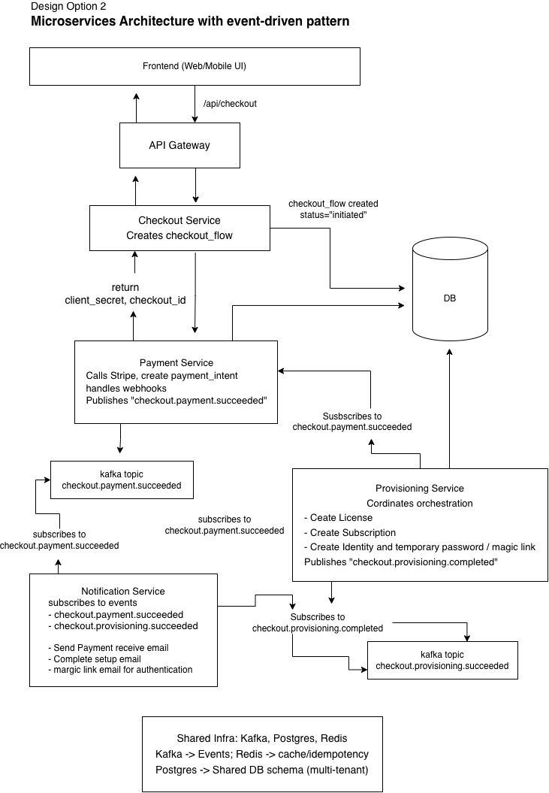

## Checkout Flow for a Express VPN Checkout
High-level architecture and components diagram




*Design Option 1: Modular Monolithic / Domain Driven Architecture with Event Driven Pattern*

```
Domain Modules (Here is how we structure the monolith internally)
/src
 ├── modules/
 │   ├── checkout/                    → Orchestrates the workflow (Saga/Process Manager)
 │   ├── payment/                     → Handles payment via external provider (e.g., Stripe)
 │   ├── license/                     → Issues VPN licenses, integrates with internal VPN infra
 │   ├── subscription/                → Manages plan, billing cycle, renewal
 │   ├── identity(user/customer)/     → Creates user identity, temp password
 │   ├── auth/                        → Create magic link, email token, JWT token (access token)
 │   └── notification/                → Sends email/magic link via BullMQ / Kafka worker
 │
 ├── libs/
 │   ├── kafka/              → Kafka producer/consumer abstraction
 │   ├── database/           → Kysely + Postgres connection, migrations
 │   ├── repos/              → modules database repos
 │   ├── common/             → Shared DTOs, events, error types
 │   └── utils/              → Logging, idempotency helpers, etc.
 │
 ├── app.ts                  → Entry point
 └── server.ts               → Server setup and integration

```

### Steps Workflow

#### Complete End-to-End Workflow
1. **Frontend Initiation**
   - User selects VPN plan on Frontend (Web/Mobile UI)
   - Frontend calls `/api/checkout` (start checkout)
   - API Gateway creates initial checkout flow record

2. **Checkout Module Orchestration**
   - Checkout Module receives request and initializes workflow
   - Creates entry in `checkout_flows` table with status="initiated"
   - Triggers express-vpn-api workflow using Saga/Workflow Orchestrator

3. **Payment Processing (Step 1)**
   - **PaymentService** creates Stripe PaymentIntent
   - Create PaymentIntent, payment record
   - Return client_secret to the frontend
   - Handles webhook from Stripe (`/api/payment/webhook`)
   - Updates `payments` table with payment status
   - Updates `checkout_flows` status `payment_success` with payment status
   - On success: Emits `payment_success` event (Kafka topic)

3. **Notification Phase (Step 2)**
   - **NotificationWorker** receives `payment_success` events
   - Sends Payment Confirmation Email to user

4. **Provisioning Phase (Step 2)**
   - **ProvisioningWorker** receives `payment_succes` event
   - Executes three parallel operations:
     
     **4a. License Creation (Step 3)**
     - Creates license in `licenses` table
     - Generates unique `license_key`
     - Create License record
     - Update `checkout_flows` status `license_status`
     
     **4b. Subscription Management (Step 4)**
     - Creates subscription record in `subscriptions` table
     - Sets billing cycle and next billing date
     - Create Subscription record
     - Update `checkout_flows` status `subscription_status`
     
     **4c. Identity Creation (Step 5)**
     - Creates user identity in `identities` table
     - Generates temporary password hash
     - Creates magic link token
     - Update `checkout_flows` status `identity_status`

   - On Provisioning Complete: Emits `provisioning_complete` event (Kafka topic)

5. **Notification Phase (Final Step)**
   - **NotificationWorker** receives `provisioning_complete` events
   - Sends Setup Complete Email with magic link
   - Updates `notifications` table with delivery status

6. **Final Completion**
   - Workflow Orchestrator receives all completion events
   - Updates `checkout_flows` table: status="complete"
   - Emits `checkout_complete` event (Kafka topic)
   - Returns success secret to Frontend

7. **User Activation**
   - User receives Setup Complete Email
   - Clicks magic link to activate account
   - Gets redirected to VPN setup page with credentials

#### Event Flow Summary
```
Frontend → API Gateway → Checkout Module → PaymentService → Stripe
                                      ↓
Kafka: payment_success → ProvisioningWorker
               ↓                      ↓
      NotificationWorker              ↓
                                      ↓
[License, Subscription, Identity] → NotificationWorker
                                      ↓
Kafka: checkout_complete → Frontend (success response)
```

#### Error Handling & Compensation
- Failed steps are logged in `failed_workflows` table
- Saga pattern ensures compensation actions (e.g., refund payment if license creation fails)
- Retry mechanisms with exponential backoff for transient failures
- Dead letter queues for permanently failed events

## Architectural Trade-offs

### ✅ **Advantages of This Design**

#### **1. Event-Driven Architecture with Kafka**
- **Decoupling**: Services communicate via events, not direct calls
- **Scalability**: Each worker (Provisioning, Notification) can scale independently
- **Reliability**: Message persistence ensures no data loss during failures
- **Audit Trail**: Complete event history for compliance and debugging

#### **2. Modular Monolithic Structure**
- **Simplified Deployment**: Single application with multiple modules
- **Shared Resources**: Database connections, configurations, and utilities
- **Easy Development**: All code in one repository, simpler testing
- **Transaction Management**: Easier to maintain data consistency

#### **3. Worker Architecture Options**
- **Same Process**: Both workers run in main application (simpler ops)
- **Worker Threads**: CPU-intensive tasks isolated using `worker_threads`
- **Separate Processes**: Independent scaling via Docker containers

### ⚠️ **Trade-offs & Considerations**

#### **1. Complexity vs Simplicity**
- **Eventual Consistency**: Users see "processing" before completion
- **Distributed Debugging**: Tracing across multiple components
- **Infrastructure Overhead**: Kafka, monitoring, alerting setup

#### **2. Performance Characteristics**
- **User Experience**: Immediate response, background processing
- **Resource Usage**: Higher memory for event queues and workers
- **Latency**: Network hops between components add small delays

#### **3. Operational Complexity**
- **Monitoring**: Need to track events across multiple topics/workers
- **Deployment**: More moving parts to coordinate
- **Error Handling**: Distributed failure scenarios to consider
- **Testing**: Integration testing across event flows

### 🎯 **When This Architecture Makes Sense**

#### **Good Fit For:**
- ✅ Multi-step business processes (payment → provisioning → notification)
- ✅ Different scaling requirements per component
- ✅ Reliability requirements (financial transactions)
- ✅ Plans to evolve toward microservices



*Design Option 2: Microservices Architecture with Event Driven Pattern*


## Database Schema (Table)
| Purpose | Table | Key Fields |
|---------|-------|------------|
| Track flow progress | `checkout_flows` | `status`, `current_step`, `retry_count` |
| Store payment data | `payments` | `payment_intent_id`, `status`, `idempotency_key` |
| Issue VPN license | `licenses` | `license_key`, `status` |
| Store plan info | `subscriptions` | `plan`, `billing_cycle`, `status` |
| User identity | `identities` | `email`, `temp_password_hash`, `magic_link_token` |
| Email logs | `notifications` | `type`, `status`, `retry_count` |
| Reliable event publishing | `integration_events` | `event_type`, `payload`, `published` |
| Error tracking | `failed_workflows` | `failed_step`, `error_message` |


### Types (Models)
#### Checkout Flow Model
```
export type CheckoutStatus =
  | 'initiated'
  | 'payment_success'
  | 'provisioning'
  | 'complete'
  | 'failed';

export interface CheckoutFlow {
  id: string;
  session_id: string;
  email: string;
  amount_cents: number;
  currency: string;
  status: CheckoutStatus;
  current_step: string | null;
  license_status: 'pending' | 'success' | 'failed';
  subscription_status: 'pending' | 'success' | 'failed';
  identity_status: 'pending' | 'success' | 'failed';
  retry_count: number;
  error_message?: string | null;
  created_at: Date;
  updated_at: Date;
}
```

#### Payment Model
```
export type PaymentStatus =
  | 'initiated'
  | 'succeeded'
  | 'failed'
  | 'refunded';

export interface Payment {
  id: string; // UUID
  checkout_flow_id: string; // FK → checkout_flows.id
  payment_intent_id: string; // Stripe payment intent ID
  status: PaymentStatus;
  amount_cents: number;
  currency: string;
  provider: 'stripe' | 'paypal';
  payment_method?: string | null;
  idempotency_key: string; // for retries
  created_at: Date;
  updated_at: Date;
}
```

#### Licese
```
export type LicenseStatus = 'active' | 'revoked' | 'expired';

export interface License {
  id: string; // UUID
  checkout_flow_id: string; // FK → checkout_flows.id
  license_key: string; // Unique license token
  user_email: string;
  status: LicenseStatus;
  valid_from: Date;
  valid_until: Date | null;
  created_at: Date;
}
```

#### Subscription
```
export type SubscriptionStatus =
  | 'active'
  | 'cancelled'
  | 'expired'
  | 'pending';

export interface Subscription {
  id: string; // UUID
  checkout_flow_id: string; // FK → checkout_flows.id
  plan: 'monthly' | 'annual' | 'trial';
  billing_cycle: string; // e.g. "1_month", "12_months"
  amount_cents: number;
  next_billing_date?: Date | null;
  status: SubscriptionStatus;
  created_at: Date;
}
```

#### Identity
```
export type IdentityStatus = 'pending' | 'active' | 'disabled';

export interface Identity {
  id: string; // UUID
  checkout_flow_id: string; // FK → checkout_flows.id
  email: string;
  temp_password_hash?: string | null;
  status: IdentityStatus;
  magic_link_token?: string | null;
  expires_at?: Date | null;
  created_at: Date;
}
```

#### Notification
```
export type NotificationType =
  | 'payment_success'
  | 'setup_complete'
  | 'magic_link'
  | 'reset_link'

export type NotificationStatus =
  | 'pending'
  | 'sent'
  | 'failed'
  | 'retrying';

export interface Notification {
  id: string; // UUID
  checkout_flow_id: string; // FK → checkout_flows.id
  type: NotificationType;
  status: NotificationStatus;
  recipient_email: string;
  message_id?: string | null; // Mailgun ID
  retry_count: number;
  created_at: Date;
  updated_at: Date;
}
```

#### IntegrationEvent
```
-- For kafka publishing
export interface IntegrationEvent {
  id: string; // UUID
  event_type: string; // e.g. "payment_success", "license_created"
  payload: Record<string, any>;
  published: boolean;
  created_at: Date;
}
```

#### FailedWorkflow
```
export interface FailedWorkflow {
  id: string; // UUID
  checkout_flow_id: string; // FK → checkout_flows.id
  failed_step: string;
  error_message?: string | null;
  compensation_done: boolean;
  created_at: Date;
}
```


